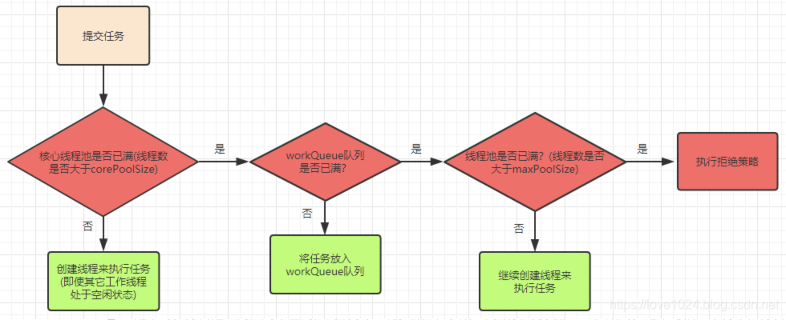

# 进程和线程
### 进程
- 进程是程序的一次动态执行过程，它需要经历从代码加载，代码执行到执行完毕的一个完整的过程，这个过程也是进程本身从产生，发展到最终消亡的过程。
- 多进程操作系统能同时达运行多个进程（程序），由于 CPU 具备分时机制，所以每个进程都能循环获得自己的CPU 时间片。由于 CPU 执行速度非常快，使得所有程序好像是在同时运行一样。
### 线程
- 线程是比进程更小的执行单位，线程是进程的基础之上进行进一步的划分。
- 多线程是实现并发机制的一种有效手段。所谓多线程是指一个进程在执行过程中可以产生多个更小的程序单元，这些更小的单元称为线程，这些线程可以同时存在，同时运行，一个进程可能包含多个同时执行的线程。进程与线程的区别如图所示： 
### 线程的五种状态
- **创建状态（New）**
  - 在程序中用构造方法创建了一个线程对象后，新的线程对象便处于新建状态。新建一个线程对象可采用 Thread 类的构造方法来实现，例如 `Thread thread = new Thread()`
  - 此时它已经有了相应的内存空间和其他资源，但还处于不可运行状态。
- **就绪状态（Runnable）**
  - 新建线程对象后，调用该线程的 `start()` 启动线程。
  - 当线程启动时，线程进入就绪状态。
  - 此时，线程将进入线程队列排队，等待 CPU 服务，这表明它已经具备了运行条件。
- **运行状态（Running）**
  - 当就绪状态被调用并获得处理器资源时，线程就进入了运行状态。
  - 此时，自动调用该线程对象的 `run()` 方法。`run()` 方法定义该线程的操作和功能。
- **阻塞状态（Blocked）**
  - 一个正在执行的线程在某些特殊情况下，如被人为挂起或需要执行耗时的输入/输出操作，会让 CPU 暂时中止自己的执行，进入阻塞状态。
  - 在可执行状态下，如果调用`sleep()`, `suspend()`, `wait()` 等方法，线程都将进入阻塞状态。
  - 发生阻塞时线程不能进入排队队列，只有当引起阻塞的原因被消除后，线程才可以转入就绪状态。
- **死亡状态（Dead）**
  - 线程调用 `stop()` 方法时或 `run()` 方法执行结束后，即处于死亡状态。
  - 处于死亡状态的线程不具有继续运行的能力。

# Java线程
### Java线程的六种状态
- **初始（NEW）**
  - 新创建了一个线程对象，但还没有调用start()方法。
- **运行（RUNNABLE）**
  - Java线程中将就绪（ready）和运行中（running）两种状态笼统的称为"运行"。
  - 线程对象创建后，其他线程调用了该对象的 `start()` 方法。该状态的线程位于可运行线程池中，等待被线程调度选中，获取CPU的使用权，此时处于就绪状态（ready）。
  - 就绪状态的线程在获得CPU时间片后变为运行中状态（running）。
- **阻塞（BLOCKED）**：
  - 表示线程阻塞于锁。
- **等待（WAITING）**
  - 进入该状态的线程需要等待其他线程做出一些特定动作（通知或中断）
- **超时等待（TIMED_WAITING）**
  - 该状态不同于WAITING，它可以在指定的时间后自行返回。
- **终止（TERMINATED）**
  - 表示该线程已经执行完毕。

### 实现方式
1. 继承 Thread 类
1. 创建一个类去实现 Runnable 接口，然后将这个类以参数的形式传递给 Thread 类 
1. 实现 Callable 接口
1. 线程池
### Thread和Runnable
Thread 类的定义：
```
public class Thread extends Object implements Runnable { ... }
```

run 的源码：
```
// private Runnable target; 

public void run() {
     if (target != null) {  // target是Runnable的实现类，如果从构造方法中传入，target就不为空
          target.run();
     }
}
```
如果继承了Thread类，就重写了run方法，这是就调用了子类中的run方法了。

run()方法是不需要用户来调用的。当通过start()方法启动一个线程之后，一旦线程获得了CPU执行时间，便进入run()方法体去执行具体的任务。

一般来说，有两种方式可以达到重写run()方法的效果：

- 直接重写：直接继承Thread类并重写run()方法；
- 间接重写：通过Thread构造函数传入Runnable对象（注意，实际上重写的是Runnable对象的run()方法）。

### 为什么实现 Runnable 优于继承 Thread 类
1. 避免单继承的局限，一个类可以同时实现多个接口
1. 适合资源的共享
    1. 如果每个线程执行的代码相同，可以使用同一个 Runnable 对象，这个 Runnable 对象中有那个共享数据
    1. 如果每个线程执行的代码不同，这时候需要用不同的 Runnable 对象，但是可以：
        1. 将共享数据封装在另外一个对象中，然后将这个对象逐一传递给各个Runnable对象。每个线程对共享数据的操作方法也分配到那个对象身上去完成，这样容易实现针对该数据进行的各个操作的互斥和通信
        1. 将这些Runnable对象作为某一个类中的内部类，共享数据作为这个外部类中的成员变量，每个线程对共享数据的操作方法也分配给外部类，以便实现对共享数据进行的各个操作的互斥和通信，作为内部类的各个Runnable对象调用外部类的这些方法
        1. 上面两种方式的组合：将共享数据封装在另外一个对象中，每个线程对共享数据的操作方法也分配到那个对象身上去完成，对象作为这个外部类中的成员变量或方法中的局部变量，每个线程的Runnable对象作为外部类中的成员内部类或局部内部类
        1. 总之，要同步互斥的几段代码最好是分别放在几个独立的方法中，这些方法再放在同一个类中，这样比较容易实现它们之间的同步互斥和通信
    1. 极端且简单的方式，即在任意一个类中定义一个static的变量，这将被所有线程共享。

### Thread 类常见方法
**`start()`** 启动一个线程，当调用该方法后，相应线程就会进入就绪状态，该线程中的run()方法会在某个时机被调用。

**`sleep()`** 让线程进入阻塞状态。“在未来的多少毫秒内我不参与CPU竞争”。

- 如果调用了sleep方法，必须捕获InterruptedException异常或者将该异常向上层抛出。
- sleep方法**不会**释放该线程所拥有的资源（例如锁），也就是说如果当前线程持有对某个对象的锁，则即使调用sleep方法，其他线程也无法访问这个对象。
- `Thread.Sleep(0)` “触发操作系统立刻重新进行一次CPU竞争”
  - 释放cpu时间，让线程马上重新回到就绪队列而非等待队列，sleep(0)释放当前线程所剩余的时间片（如果有剩余的话），这样可以让操作系统切换其他线程来执行，提升效率。
  - 并非是真的要线程挂起0毫秒，意义在于这次调用Thread.Sleep(0)的当前线程确实的被冻结了一下，让其他线程有机会优先执行。Thread.Sleep(0) 是你的线程暂时放弃cpu，也就是释放一些未用的时间片给其他线程或进程使用，就相当于一个让位动作。
  
**`join()`** 当前线程调用其他线程的join方法，会阻塞当前线程，直到其他线程执行完毕，才会进入就绪状态。
- 可以使用 join() 方法让一个线程强制运行，线程强制运行期间，其他线程无法运行，必须等待此线程完成之后才可以继续执行。
- join方法被Synchronized关键字所修饰，所以如果有两个线程同时调用另外一个线程的join方法，其中一个线必须等待（进入阻塞状态），在得到锁之后才会执行join方法。
- join方法是通过wait方法（Object提供的方法）实现的。当 millis == 0 时，会进入 while(isAlive()) 循环，并且只要子线程是活的，宿主线程就不停的等待。join方法同样会让线程交出CPU执行权限；join方法同样会让线程释放对一个对象持有的锁；

**`yield()`** 让当前线程放弃获取的CPU时间片，但不释放锁资源，由运行状态变为就绪状态，让OS再次选择线程。
- 作用：让相同优先级的线程轮流执行，但并不保证一定会轮流执行。实际中无法保证yield()达到让步目的，因为让步的线程还有可能被线程调度程序再次选中。
- Thread.yield()不会导致阻塞，而是让线程重回就绪状态，与sleep()类似，只是不能由用户指定暂停多长时间。

**`interrupt()`** 当一个线程运行时，另外一个线程可以直接通过interrupt()方法中断其运行状态。

总结：
- 释放锁：`wait()`, `join()`
- 不释放锁：`sleep()`, `yield()`

### Callable
### 线程池（Executor, Executors, ExecutorService, ThreadPoolExecutor）
- **加快请求响应（响应时间优先）**：不设置队列去缓冲并发的请求，而是适当调高corePoolSize和maxPoolSize去尽可能的创造线程来执行任务。
- **加快处理大任务（吞吐量优先）**：设置队列来缓冲并发任务，并且设置合理的corePoolSize和maxPoolSize参数，这个时候如果设置了太大的corePoolSize和maxPoolSize可能还会因为线程上下文频繁切换降低任务处理速度，从而导致吞吐量降低。

线程池可以自动创建也可以手动创建
- 自动创建体现在Executors工具类中，常见的可以创建newFixedThreadPool、newCachedThreadPool、newSingleThreadExecutor、newScheduledThreadPool
- 手动创建体现在可以灵活设置线程池的各个参数

#### 线程池中的线程创建流程图：

1. 判断核心线程池里的线程是否都在执行任务
   1. 如果不是，则创建一个新的工作线程来执行任务
   1. 如果核心线程池里的线程都在执行任务，则执行第二步。
1. 判断工作队列是否已经满
   1. 如果工作队列没有满，则将新提交的任务存储在这个工作队列里进行等待
   1. 如果工作队列满了，则执行第三步
1. 判断线程池的线程是否都处于工作状态
   1. 如果没有，则创建一个新的工作线程来执行任务
   1. 如果已经满了，则交给饱和策略来处理这个任务

#### 线程池参数
```
public ThreadPoolExecutor(int corePoolSize,
                          int maximumPoolSize,
                          long keepAliveTime,
                          TimeUnit unit,
                          BlockingQueue<Runnable> workQueue,
                          ThreadFactory threadFactory,         // Executors.defaultThreadFactory()
                          RejectedExecutionHandler handler)    // defaultHandler
{...}
```
- **corePoolSize**：核心线程数，也是线程池中常驻的线程数，线程池初始化时默认是没有线程的，当任务来临时才开始创建线程去执行任务
- **maximumPoolSize**：最大线程数，在核心线程数的基础上可能会额外增加一些非核心线程，需要注意的是只有当workQueue队列填满时才会创建多于corePoolSize的线程(线程池总线程数不超过maxPoolSize)
- **keepAliveTime**：非核心线程的空闲时间超过keepAliveTime就会被自动终止回收掉，注意当corePoolSize=maxPoolSize时，keepAliveTime参数也就不起作用了(因为不存在非核心线程)；
- **unit**：keepAliveTime的时间单位
- **workQueue**：用于保存任务的队列，可以为无界、有界、同步移交三种队列类型之一，当池子里的工作线程数大于corePoolSize时，这时新进来的任务会被放到队列中
  - **SynchronousQueue(同步移交队列)**：队列不作为任务的缓冲方式，可以简单理解为队列长度为零
  - **LinkedBlockingQueue(无界队列)**：队列长度不受限制，当请求越来越多时(任务处理速度跟不上任务提交速度造成请求堆积)可能导致内存占用过多或OOM
  - **ArrayBlockingQueue(有界队列)**：队列长度受限，当队列满了就需要创建多余的线程来执行任务
- **threadFactory**：创建线程的工厂类，默认使用Executors.defaultThreadFactory()，也可以使用guava库的ThreadFactoryBuilder来创建
- **handler**：线程池无法继续接收任务(队列已满且线程数达到maximumPoolSize)时的饱和策略
  - **AbortPolicy**：中断抛出异常
  - **DiscardPolicy**：默默丢弃任务，不进行任何通知
  - **DiscardOldestPolicy**：丢弃掉在队列中存在时间最久的任务
  - **CallerRunsPolicy**：让提交任务的线程去执行任务(对比前三种比较友好一丢丢)

#### 自动创建线程池
自动创建线程池的几种方式都封装在Executors工具类中：
- **`newFixedThreadPool`**：
  - `new ThreadPoolExecutor(var0, var0, 0L, TimeUnit.MILLISECONDS, new LinkedBlockingQueue())`，
  - 设置了corePoolSize=maxPoolSize，keepAliveTime=0(此时该参数没作用)，无界队列，任务可以无限放入，当请求过多时(任务处理速度跟不上任务提交速度造成请求堆积)可能导致占用过多内存或直接导致OOM异常
- **`newSingleThreadExecutor`**：
  - `new ThreadPoolExecutor(1, 1, 0L, TimeUnit.MILLISECONDS, new LinkedBlockingQueue(), var0)`
  - 基本同newFixedThreadPool，但是将线程数设置为了1，单线程，弊端和newFixedThreadPool一致
- **`newCachedThreadPool`**：
  - `new ThreadPoolExecutor(0, Integer.MAX_VALUE, 60L, TimeUnit.SECONDS, new SynchronousQueue())`
  - corePoolSize=0，maxPoolSize为很大的数，同步移交队列，也就是说不维护常驻线程(核心线程)，每次来请求直接创建新线程来处理任务，也不使用队列缓冲，会自动回收多余线程，由于将maxPoolSize设置成Integer.MAX_VALUE，当请求很多时就可能创建过多的线程，导致资源耗尽OOM
- **`newScheduledThreadPool`**：
  - `new ThreadPoolExecutor(var1, Integer.MAX_VALUE, 0L, TimeUnit.NANOSECONDS, new ScheduledThreadPoolExecutor.DelayedWorkQueue())`
  - 支持定时周期性执行，注意一下使用的是延迟队列，弊端同newCachedThreadPool一致

#### 关闭线程池
- **`shutdownNow()`**：立即关闭线程池(暴力)，正在执行中的及队列中的任务会被中断，同时该方法会返回被中断的队列中的任务列表
- **`shutdown()`**：平滑关闭线程池，正在执行中的及队列中的任务能执行完成，后续进来的任务会被执行拒绝策略
- **`isTerminated()`**：当正在执行的任务及对列中的任务全部都执行（清空）完就会返回true

#### Runnable和Callable
Runnable和Callable都可以理解为任务，里面封装任务的具体逻辑，用于提交给线程池执行。区别在于Runnable任务执行没有返回值，且Runnable任务逻辑中不能通过throws抛出受检异常(但是可以try catch)，而Callable可以获取到任务的执行结果返回值且抛出受检异常。

#### Future和FutureTask
Future接口用来表示执行异步任务的结果存储器，当一个任务的执行时间过长就可以采用这种方式：把任务提交给子线程去处理，主线程不用同步等待，当向线程池提交了一个Callable或Runnable任务时就会返回Future，用Future可以获取任务执行的返回结果。

Future的主要方法包括：

- **`get()`**：返回任务的执行结果，若任务还未执行完，则会一直阻塞直到完成为止。如果执行过程中发生异常，则抛出异常，但是主线程是感知不到并且不受影响的，除非调用get()方法进行获取结果则会抛出ExecutionException异常
- **`get(long timeout, TimeUnit unit)`**：在指定时间内返回任务的执行结果，超时未返回会抛出TimeoutException，这个时候需要显式的取消任务
- **`cancel(boolean mayInterruptIfRunning)`**：取消任务，mayInterruptIfRunning表示如果任务正在运行中是否强制中断
- **`isDone()`**：判断任务是否执行完毕。执行完毕不代表任务一定成功执行，它仅仅表示一种状态说后面任务不会再执行了
- **`isCancelled()`**：判断任务是否被取消


# 并发问题
并发问题的共同特征：多个线程/进程之间共享一些资源。由于无法消除资源共享的约束，防止并发问题就变成了**资源共享的协调**问题。根据这个思路，如果可以确保程序中**关键部分代码的独占性**，就可以防止程序进入不一致的状态。

多线程如果应用不当可能会引发的漏洞：
- **竞态条件**：由于多进程之间的竞争执行，导致程序未按照期望的顺序输出
- **死锁**：线程A和线程B都需要资源a和资源b来执行程序，线程A持有资源a，线程B持有资源b，双方都等待对方所持有的资源，导致双方都无法执行
- **资源不足**：进程被永久剥夺了运行所需的资源

为了防止出现并发竞争状态，需要一种具有两种功能的机制：1）关键部分的访问控制；2）通知阻塞线程。

## Java 多线程同步
TODO
### wait(), notify(), notifyAll()
### 原子操作
### volatile
### synchronized
### ReentrantLock
### Semaphore
### CountDownLatch
使一个线程等待其他线程各自执行完毕后再执行。

通过一个计数器来实现，计数器的初始值是线程的数量。每当一个线程执行完毕后，计数器的值就-1，当计数器的值为0时，表示所有线程都执行完毕，然后在闭锁上等待的线程就可以恢复工作了

```
// 调用await()方法的线程会被挂起，它会等待直到count值为0才继续执行
public void await() throws InterruptedException { };  
 
// 和await()类似，只不过等待一定的时间后count值还没变为0的话就会继续执行
public boolean await(long timeout, TimeUnit unit) throws InterruptedException { };
  
// 将count值减1
public void countDown() { };  
```
### CyclicBarrier 与 CountDownLatch 区别
- CountDownLatch 是一次性的，CyclicBarrier 是可循环利用的
- CountDownLatch 参与的线程的职责是不一样的，有的在倒计时，有的在等待倒计时结束。CyclicBarrier 参与的线程职责是一样的

https://www.cnblogs.com/java1024/archive/2019/11/28/11950129.html

https://blog.csdn.net/absolute_chen/article/details/91891933

https://blog.csdn.net/qiaoquan3/article/details/56281092/

https://blog.csdn.net/fanrenxiang/article/details/79855992
